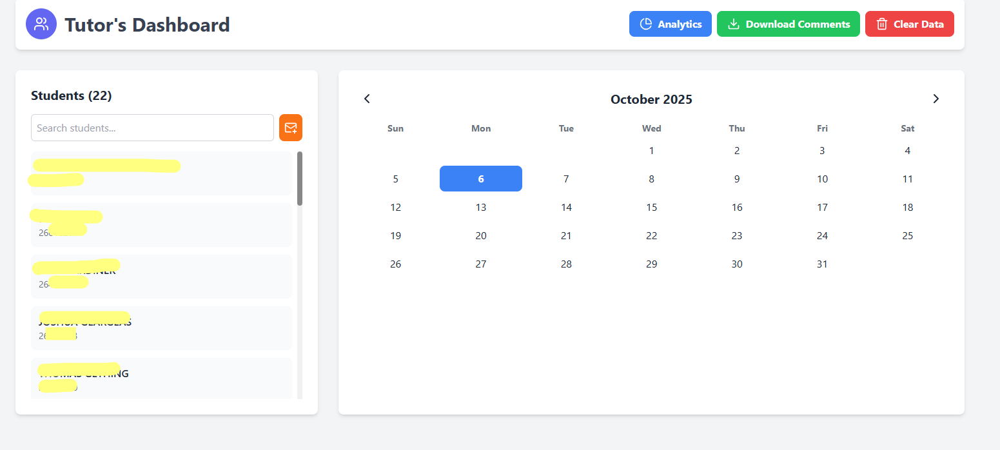
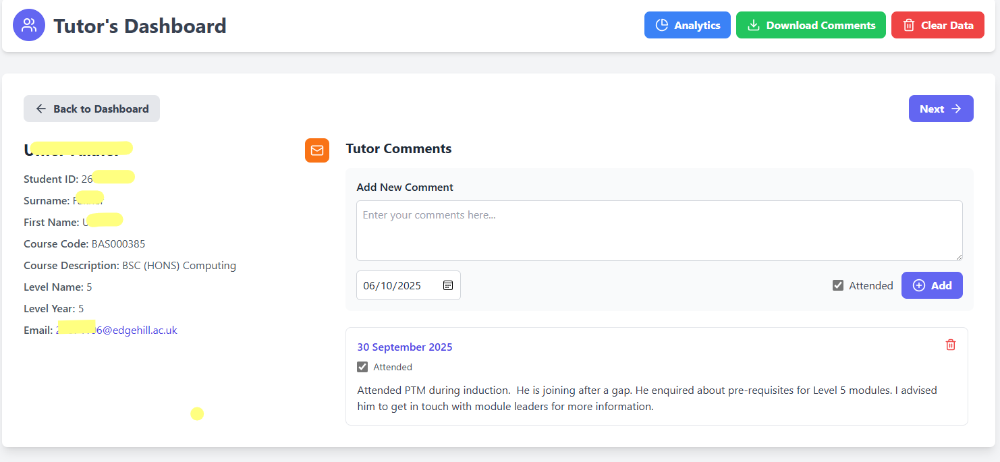

# Personal Tutor dashboard application

## Features
- The tutor can upload an excel file containing fields such as Student ID, Surname, First Name, Course Code, Course Description, Level name, Level year
- It creates search menu of all students. 
- Tutors can select one student or multiple students using the above fields as filters. To see all level 4 students search the field with message "Level 4", or "Robotics". 
- Tutor can enter comments for each tutee along with date and mark the attendance. 
- The data is stored locally on the browser. But this storage is persistent. The data will remain unless cleared explicitly by clicking on the `Clear data` button. 
- Comments could be downloaded as an excel file. 
- An analytics page provides details how many attended and % score for each students.
- It is possible to send email to individual or group of students by clicking on the `email` button. 

## Images

### Dashboard after loading excel file

### Student page

### Analytics page
